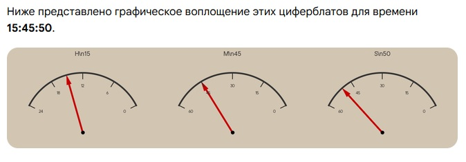

# Аналого-цифровые часы / Analog-Digital Clock

Часы на стрелочных вольтметрах: точное время берётся с аппаратного RTC
(DS1302 с батарейкой) и через 4-канальный ЦАП MCP4728 превращается
в аналоговое напряжение 0–5В для трёх стрелочных индикаторов —
часы, минуты, секунды.

## Комплектация

- Arduino Nano
- ЦАП MCP4728 (4 канала, I2C)
- Модуль реального времени DS1302 (с батарейкой)
- 3 стрелочных вольтметра 0–5В (85C1, GB7676-98)
- 3 кнопки

## Подключение

| Модуль | Пин Nano |
|---|---|
| MCP4728 SDA | A4 |
| MCP4728 SCL | A5 |
| DS1302 CLK | D7 |
| DS1302 DAT (I/O) | D6 |
| DS1302 RST (CE) | D5 |
| Кнопка «+1 час» | D2 → GND |
| Кнопка «+1 минута» | D3 → GND |
| Кнопка «сброс секунд» | D4 → GND |
| MCP4728 канал A | вольтметр «часы» |
| MCP4728 канал B | вольтметр «минуты» |
| MCP4728 канал C | вольтметр «секунды» |

Питание всех модулей — 5V/GND от Arduino Nano. Рекомендуется питать Nano
через VIN стабилизированным источником 5–9В, а не через USB-порт компьютера:
на некоторых платах защитный диод на линии USB→5V даёт просадку
(~4.7В вместо 5.0В), из-за которой ЦАП не выдаёт полный размах на
вольтметрах (опора DAC берётся от VDD).

## Логика шкал

- Часы: `(часы + минуты/60) / 24 × 4095` — плавный ход раз в минуту
- Минуты: `(минуты + секунды/60) / 60 × 4095` — плавный ход раз в секунду
- Секунды: `секунды / 60 × 4095`, раз в минуту при обнулении — короткий
  анимационный рывок стрелки

## Библиотеки

Устанавливаются через Arduino IDE → Sketch → Include Library → Manage Libraries:

- `Adafruit MCP4728`
- `Adafruit BusIO` (зависимость)
- `Rtc` (автор **Makuna**) — для DS1302, включает `ThreeWire` и `RtcDS1302`

## Настройка времени

При первой прошивке (или после разрядки батарейки RTC) часы автоматически
берут время компиляции скетча. Дальше корректируются кнопками D2/D3/D4.
